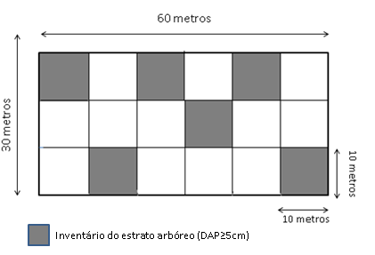
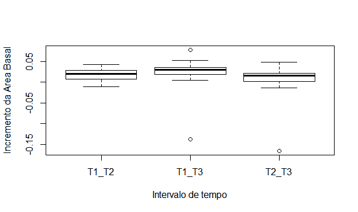

```{r setup, include=FALSE}
knitr::opts_chunk$set(echo = TRUE)
```
##Introdução

  As florestas tropicais, reservatório da maior biodiversidade e serviços ecossistêmicos do planeta, têm sua estrutura, dinâmica e funcionamento continuamente modificados por impactos antrópicos (Chazdon, 2013), restando apenas 30% de sua cobertura original (Lewis et al.  2015). Com a finalização dos distúrbio, dá-se inicio ao processo de regeneração natural, cujo acompanhamento ecológica ajuda na compreensão da trajetório sucessional e averiguação da necessidade de ações de restauração.

##Objetivos
Avaliar a mudança do incremento da área basal da comunidade ao longo de 12 anos de regeneração natural.
Analisar a relação entre o incremento da area basal de Moquiniastrum polymorphum e as demais espécies da comunidade.

##Hipóteses
Espera-se que haja aumento da área basal da comunidade.
Espera-se que o incremento de M. polymorphum seja maior que das demais espécies da comunidade.

##Metodologia
###Area de estudo e coleta de dados

  O estudo foi no realizado na Reserva Biológica de Poço das Antas (RBPA), situada no estado do Rio de Janeiro (22° 30`e 22° 33` S e 42° 19` W).A RBPA possui 5.160 ha, inserida no bioma Mata Atlântica, coberta por Floresta Ombrófila Densa de terras baixas (Veloso et al. 1991).

```{r}
knitr::include_graphics("../figs/MapaRBPA.png")
```
Figura 1: Mapa da Reserva Biológica Poço das Antas, Silva Jardim, RJ. Fonte: Sansevero (2008).

O levantamento de dados foi realizado em três parcelas permanentes (30 m x 60 m). As parcelas permanentes foram divididas em subparcelas de 10 m x 10 m, onde selecionamos aleatoriamente seis das subparcelas em cada uma das parcelas permanentes para a coleta de dados. Para a análise da dinâmica, foram utilizados levantamentos de dados realizados nas mesmas parcelas em 2006 (Sansevero 2008), 2012 (Sanchez-Tapia 2012) e 2018 (atual). Para análise da vegetação arbórea, incluímos todos os indivíduos com diâmetro a altura do peito (DAP) ≥ 5 cm, sendo mensuradas  altura e DAP, coletados para identificação botânica e depositados no Herbário do Jardim Botânico do Rio de Janeiro (RB).

```{r}


```

Figura 2: Área selecionada para a distribuição das parcelas. Parcelas selecionadas para o levantamento do estrato arbóreo (10 m x 10 m).

###Análise de dados
  Para vizualização da distribuição da área basal da comunidade ao longo dos 12 anos de regeneração, foi realizado um Boxplot.Foi realizada uma análise de variância (Kruskal-Wallis) para dados não-paramétricos entre os anos de medição (2006,2012,2018).
  Para a comparação entre o incremento da área basal, somou-se a área basal de todas as espécies da comunidade com excessão de M. polymorphum. Foi realizada uma análise de variância entre o incremento de área basal de M. polymorphum e as demais espécies da comunidade. Em seguida, foi realizado um teste de correlação entre os mesmos.

##Resultados
Foi observado através do teste de significância que há diferença significativa do incremento da área basal da comunidade para o intervalo de tempo T2_T3 para os demais.

###incluindo Boxplot
```{r}



```
Figura 3 - Boxplot do incremento da área basal entre os intervalos de tempo

###Incluindo output Análise de Variância
```{r}

```


###Incluindo output correlação

Não houve diferença significativa entre o incremento da área basal de M.polymorphum e as demais espécies da comunidade.
O incremento da área basal de M.polymorphum e as demais espécies da comunidade não mostraram correlação.
```{r}

```


